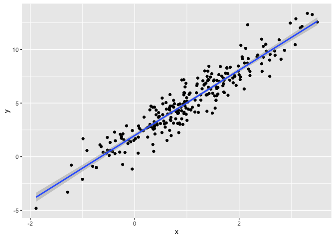

Bootstrapping
================
Mia Isaacs
2024-11-14

``` r
library(tidyverse)
```

    ## ── Attaching core tidyverse packages ──────────────────────── tidyverse 2.0.0 ──
    ## ✔ dplyr     1.1.4     ✔ readr     2.1.5
    ## ✔ forcats   1.0.0     ✔ stringr   1.5.1
    ## ✔ ggplot2   3.5.1     ✔ tibble    3.2.1
    ## ✔ lubridate 1.9.3     ✔ tidyr     1.3.1
    ## ✔ purrr     1.0.2     
    ## ── Conflicts ────────────────────────────────────────── tidyverse_conflicts() ──
    ## ✖ dplyr::filter() masks stats::filter()
    ## ✖ dplyr::lag()    masks stats::lag()
    ## ℹ Use the conflicted package (<http://conflicted.r-lib.org/>) to force all conflicts to become errors

``` r
library(p8105.datasets)

set.seed(1)
```

make up some data!!

``` r
n_samp = 250

sim_df_constant =
  tibble(
    x = rnorm(n_samp, 1, 1),
    error = rnorm(n_samp, 0, 1),
    y = 2 + 3 * x + error
  )

sim_df_nonconstant =
  sim_df_constant |> 
  mutate(
    error = error * .75 * x,
    y = 2 + 3 * x + error
  )
```

let’s look at these

``` r
sim_df_constant |> 
  ggplot(aes(x = x, y = y)) +
  geom_point() +
  stat_smooth(method = "lm")
```

    ## `geom_smooth()` using formula = 'y ~ x'

<!-- -->

``` r
sim_df_nonconstant |> 
  ggplot(aes(x = x, y = y)) +
  geom_point() +
  stat_smooth(method = "lm")
```

    ## `geom_smooth()` using formula = 'y ~ x'

<!-- -->

look at regression results

``` r
sim_df_constant |> 
  lm(y ~ x, data = _) |> 
  broom::tidy() |> 
  knitr::kable(digits = 3)
```

| term        | estimate | std.error | statistic | p.value |
|:------------|---------:|----------:|----------:|--------:|
| (Intercept) |    1.977 |     0.098 |    20.157 |       0 |
| x           |    3.045 |     0.070 |    43.537 |       0 |

``` r
sim_df_nonconstant |> 
  lm(y ~ x, data = _) |> 
  broom::tidy() |> 
  knitr::kable(digits = 3)
```

| term        | estimate | std.error | statistic | p.value |
|:------------|---------:|----------:|----------:|--------:|
| (Intercept) |    1.934 |     0.105 |    18.456 |       0 |
| x           |    3.112 |     0.075 |    41.661 |       0 |

## draw a bootstrap example

``` r
boot_sample = function(df) {
  
  boot_df =
    sample_frac(df, replace = TRUE) |> 
    arrange(x)
  
  return(boot_df)
}
```

let’s try running this

``` r
sim_df_nonconstant |> 
  boot_sample() |> 
  ggplot(aes(x = x, y = y)) +
  geom_point(alpha = .5) +
  stat_smooth(method = "lm")
```

    ## `geom_smooth()` using formula = 'y ~ x'

<!-- -->

can we do this as part of an analysis??

``` r
sim_df_nonconstant |> 
  boot_sample() |> 
  lm(y ~ x, data = _) |> 
  broom::tidy() |> 
  knitr::kable(digits = 3)
```

| term        | estimate | std.error | statistic | p.value |
|:------------|---------:|----------:|----------:|--------:|
| (Intercept) |    1.896 |     0.098 |    19.311 |       0 |
| x           |    3.142 |     0.069 |    45.636 |       0 |

## bootstrap a lot

``` r
boot_straps =
  tibble(
    strap_number = 1:1000
  ) |> 
  mutate(
    strap_sample = map(strap_number, \(i) boot_sample(df = sim_df_nonconstant)),
    models = map(strap_sample, \(df) lm(y ~ x, data = df)),
    results = map(models, broom::tidy)
  )

bootstrap_results =
  boot_straps |> 
  select(strap_number, results) |> 
  unnest(results) |> 
  group_by(term) |> 
  summarize(
    boot_se = sd(estimate)
  ) |> 
  knitr::kable(digits = 3)
```

## do this using modelr

``` r
boot_straps =
  sim_df_constant |> 
  modelr::bootstrap(1000) |> 
  mutate(
    strap = map(strap, as_tibble),
    models = map(strap, \(df) lm(y ~ x, data = df)),
    results = map(models, broom::tidy)
  ) |> 
  select(.id, results) |> 
  unnest(results)
```

## what do you want to report

``` r
boot_straps |> 
  group_by(term) |> 
  summarize(
    boot_est = mean(estimate),
    boot_se = sd(estimate),
    boot_ci_ll = quantile(estimate, .025),
    boot_ci_ul = quantile(estimate, .975)
  )
```

    ## # A tibble: 2 × 5
    ##   term        boot_est boot_se boot_ci_ll boot_ci_ul
    ##   <chr>          <dbl>   <dbl>      <dbl>      <dbl>
    ## 1 (Intercept)     1.98  0.0984       1.78       2.16
    ## 2 x               3.04  0.0720       2.91       3.19

# airbnb data

``` r
data("nyc_airbnb")

nyc_airbnb = 
  nyc_airbnb |> 
  mutate(stars = review_scores_location / 2) |> 
  rename(
    borough = neighbourhood_group,
    neighborhood = neighbourhood) |> 
  filter(borough != "Staten Island") |> 
  drop_na(price, stars) |> 
  select(price, stars, borough, neighborhood, room_type)
```

plot the data

``` r
nyc_airbnb |> 
  ggplot(aes(x = stars, y = price, color = room_type)) + 
  geom_point() 
```

<!-- -->

``` r
nyc_airbnb |> 
  filter(borough == "Manhattan") |> 
  modelr::bootstrap(n = 1000) |> 
  mutate(
    models = map(strap, \(df) lm(price ~ stars + room_type, data = df)),
    results = map(models, broom::tidy)) |> 
  select(results) |> 
  unnest(results) |> 
  filter(term == "stars") |> 
  ggplot(aes(x = estimate)) + geom_density()
```

<!-- -->
