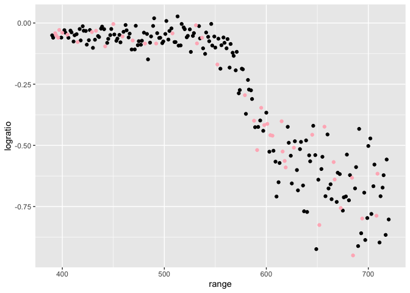
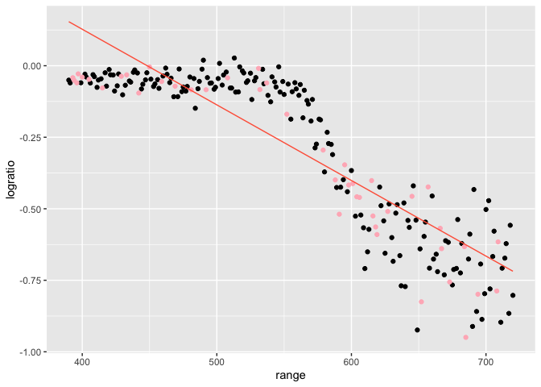
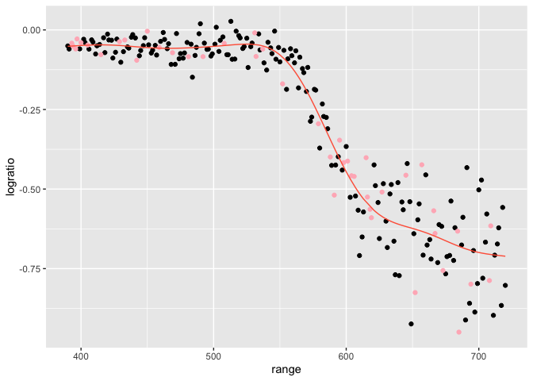
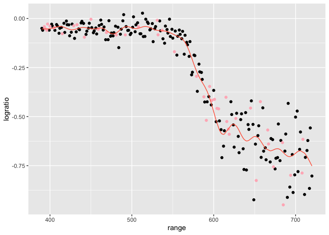
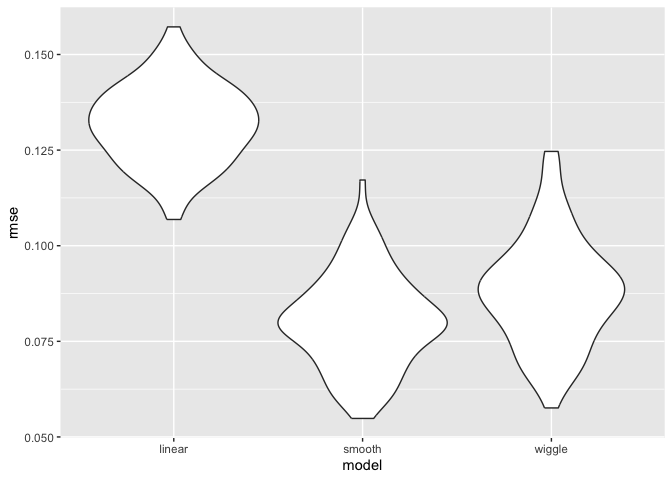
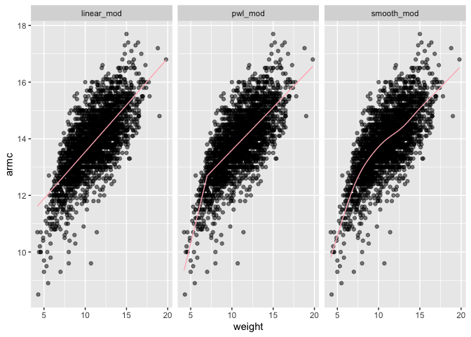
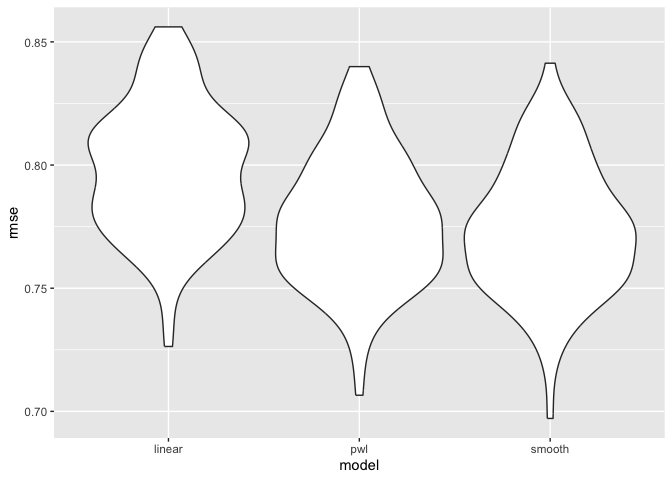

Cross Validation
================
Mia Isaacs
2024-11-12

``` r
library(tidyverse)
```

    ## ── Attaching core tidyverse packages ──────────────────────── tidyverse 2.0.0 ──
    ## ✔ dplyr     1.1.4     ✔ readr     2.1.5
    ## ✔ forcats   1.0.0     ✔ stringr   1.5.1
    ## ✔ ggplot2   3.5.1     ✔ tibble    3.2.1
    ## ✔ lubridate 1.9.3     ✔ tidyr     1.3.1
    ## ✔ purrr     1.0.2     
    ## ── Conflicts ────────────────────────────────────────── tidyverse_conflicts() ──
    ## ✖ dplyr::filter() masks stats::filter()
    ## ✖ dplyr::lag()    masks stats::lag()
    ## ℹ Use the conflicted package (<http://conflicted.r-lib.org/>) to force all conflicts to become errors

``` r
library(modelr)
library(mgcv)
```

    ## Loading required package: nlme
    ## 
    ## Attaching package: 'nlme'
    ## 
    ## The following object is masked from 'package:dplyr':
    ## 
    ##     collapse
    ## 
    ## This is mgcv 1.9-1. For overview type 'help("mgcv-package")'.

``` r
library(SemiPar)

set.seed(1)
```

look at LIDAR data

``` r
data("lidar")

lidar_df =
  lidar |> 
  as_tibble() |> 
  mutate(id = row_number())
```

``` r
lidar_df |> 
  ggplot(aes(x = range, y = logratio)) +
  geom_point()
```

<!-- -->

## trying to do CV

we’ll compare 3 models - one linear, one smooth, one wiggly

construct training and testing df

``` r
train_df = sample_frac(lidar_df, size = .8)
test_df = anti_join(lidar_df, train_df, by = "id")
```

look at these

``` r
ggplot(train_df, aes(x = range, y = logratio)) +
  geom_point() +
  geom_point(data = test_df, color = "lightpink")
```

<!-- -->

fit three models

``` r
linear_mod = lm(logratio ~ range, data = train_df)
smooth_mod = gam(logratio ~ s(range), data = train_df)
wiggle_mod = gam(logratio ~ s(range, k = 30), sp = 10e-6, data = train_df)
```

look at fits

``` r
train_df |> 
  add_predictions(linear_mod) |> 
  ggplot(aes(x = range, y = logratio)) +
  geom_point() +
  geom_point(data = test_df, color = "lightpink") +
  geom_line(aes(y = pred), color = "tomato")
```

<!-- -->

``` r
train_df |> 
  add_predictions(smooth_mod) |> 
  ggplot(aes(x = range, y = logratio)) +
  geom_point() +
  geom_point(data = test_df, color = "lightpink") +
  geom_line(aes(y = pred), color = "tomato")
```

<!-- -->

``` r
train_df |> 
  add_predictions(wiggle_mod) |> 
  ggplot(aes(x = range, y = logratio)) +
  geom_point() +
  geom_point(data = test_df, color = "lightpink") +
  geom_line(aes(y = pred), color = "tomato")
```

<!-- -->

compare these numerically using RMSE

``` r
rmse(linear_mod, test_df)
```

    ## [1] 0.127317

``` r
rmse(smooth_mod, test_df)
```

    ## [1] 0.08302008

``` r
rmse(wiggle_mod, test_df)
```

    ## [1] 0.08848557

# repeat the train / test split

``` r
cv_df =
  crossv_mc(lidar_df, 100) |> 
  mutate(
    train = map(train, as_tibble),
    test = map(test, as_tibble)
  )
```

``` r
cv_df |> 
  pull(train) |> 
  nth(3) |> 
  as_tibble()
```

fit models, extract RMSEs

``` r
cv_res_df =
  cv_df |> 
  mutate(
    linear_mod = map(train, \(x) lm(logratio ~ range, data = x)),
    smooth_mod = map(train, \(x) gam(logratio ~ s(range), data = x)),
    wiggle_mod = map(train, \(x) gam(logratio ~ s(range, k = 30), sp = 10e-6, data = x))
  ) |> 
  mutate(
    rmse_linear = map2_dbl(linear_mod, test, rmse),
    rmse_smooth = map2_dbl(smooth_mod, test, rmse),
    rmse_wiggle = map2_dbl(wiggle_mod, test, rmse)
  )
```

look at RMSE distribution

``` r
cv_res_df |> 
  select(starts_with("rmse")) |> 
  pivot_longer(
    everything(),
    names_to = "model",
    values_to = "rmse",
    names_prefix = "rmse_"
  ) |> 
  ggplot(aes(x = model, y = rmse)) +
  geom_violin()
```

<!-- -->

## nepalese children df

``` r
child_df = 
  read_csv("./data/nepalese_children.csv") |> 
  mutate(
    weight_ch7 = (weight > 7) * (weight - 7)
  )
```

    ## Rows: 2705 Columns: 5
    ## ── Column specification ────────────────────────────────────────────────────────
    ## Delimiter: ","
    ## dbl (5): age, sex, weight, height, armc
    ## 
    ## ℹ Use `spec()` to retrieve the full column specification for this data.
    ## ℹ Specify the column types or set `show_col_types = FALSE` to quiet this message.

look at data

``` r
child_df |> 
  ggplot(aes(x = weight, y = armc)) + 
  geom_point(alpha = .5)
```

<!-- -->

fit some models

``` r
linear_mod = lm(armc ~ weight, data = child_df)
pwl_mod    = lm(armc ~ weight + weight_ch7, data = child_df)
smooth_mod = gam(armc ~ s(weight), data = child_df)
```

``` r
child_df |> 
  gather_predictions(linear_mod, pwl_mod, smooth_mod) |> 
  mutate(model = fct_inorder(model)) |> 
  ggplot(aes(x = weight, y = armc)) + 
  geom_point(alpha = .5) +
  geom_line(aes(y = pred), color = "lightpink") + 
  facet_grid(~model)
```

<!-- -->

cross validation to select models

``` r
cv_df =
  crossv_mc(child_df, 100) |> 
  mutate(
    train = map(train, as_tibble),
    test = map(test, as_tibble))
```

``` r
cv_df = 
  cv_df |> 
  mutate(
    linear_mod  = map(train, \(df) lm(armc ~ weight, data = df)),
    pwl_mod     = map(train, \(df) lm(armc ~ weight + weight_ch7, data = df)),
    smooth_mod  = map(train, \(df) gam(armc ~ s(weight), data = as_tibble(df)))) |> 
  mutate(
    rmse_linear = map2_dbl(linear_mod, test, \(mod, df) rmse(model = mod, data = df)),
    rmse_pwl    = map2_dbl(pwl_mod, test, \(mod, df) rmse(model = mod, data = df)),
    rmse_smooth = map2_dbl(smooth_mod, test, \(mod, df) rmse(model = mod, data = df)))
```

``` r
cv_df |> 
  select(starts_with("rmse")) |> 
  pivot_longer(
    everything(),
    names_to = "model", 
    values_to = "rmse",
    names_prefix = "rmse_") |> 
  mutate(model = fct_inorder(model)) |> 
  ggplot(aes(x = model, y = rmse)) + geom_violin()
```

<!-- -->
